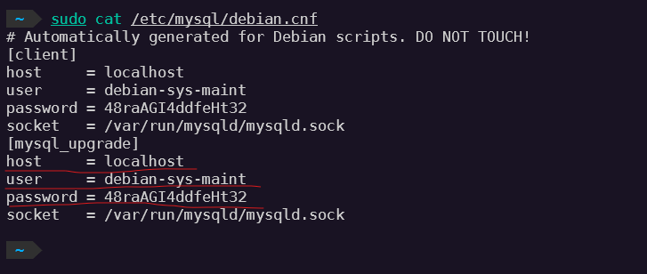
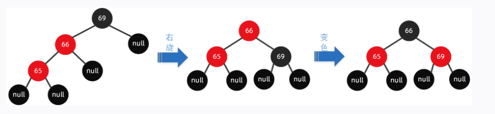
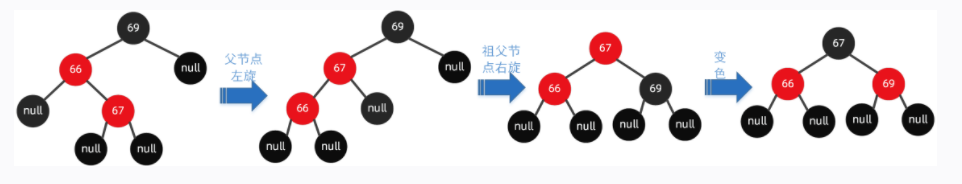
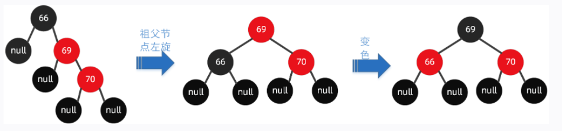
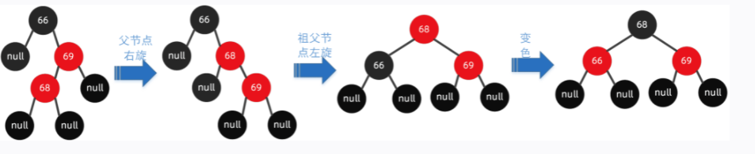

### MySQL 8.04及以上版本修改root密码

1. 启动MySQL服务
   
* 使用service管理
  
  ```
  sudo service mysql start
  sudo service mysql status
  sudo service mysql restart
  sudo service mysql stop
  ```

2. 在 /etc/mysql/debain.cnf文件中查看登录名称和密码。
   
    

3. 使用账号密码连接到mysql，修改root密码
   
   ```
   mysql> use mysql;

   mysql> ALTER USER 'root'@'localhost' IDENTIFIED WITH mysql_native_password BY '新密码';

   mysql> FLUSH PRIVILEGES;

### 红黑树 red-black tree

#### 1. 基本规则
  
  * 结点要么是红色要么是黑色，根节点一定是黑色的
  * 不能连续出现两个及以上红色节点，也就是说红色节点的子节点必须是黑色的。
  * 任何一个节点到其叶子节点路径上的黑色节点数量相等。叶子节点被认为是黑色节点。

红黑树的最大高度：h = 2 * log2(n+1)

黑高 （black height）：从一个节点到其叶子节点所经过的黑节点数量（计数包含当前节点，但是不包含叶子节点）。


#### 2. 插入节点各个情况讨论

2.1 插入节点的叔叔节点为黑的情况（空节点也是黑节点）

* 父节点和插入的节点都是左节点（LL型）

  先将父节点变为黑色，祖父节点变为红色，然后以祖父节点右旋。
  

* 父节点是左节点，插入的节点是右节点（LR型）

  先以父节点左旋，变成 LL型，再用 LL型的方式变换。
  

* 父节点和插入节点都是右节点（RR型）

  先将父节点变为黑色，祖父节点变为红色，然后以祖父节点左旋
  

* 父节点是右节点，插入节点是左节点（RL型）

  先以父节点右旋，变成 RR型，再用 RR型的方式变换
  

2.2 插入节点的叔叔节点为红的情况

* 将父节点和叔叔节点的颜色设置为黑色，将祖父节点颜色设置为红色。再以祖父节点为当前节点向上回溯。

2.3 插入总结

| 父节点颜色 | 叔叔节点颜色       | 操作                                                               |
| ---------- | ------------------ | ------------------------------------------------------------------ |
| 黑色       | -                  | -                                                                  |
| 红色       | 红色               | 将父节点和叔叔节点变成黑色，祖父节点变成红色，再从祖父节点向上回溯 |
| 红色       | 黑色（包含空节点） | LL型，父节点变黑色，祖父节点变红色，再以祖父节点右旋               |
| 红色       | 黑色（包含空节点） | LR型，以父节点左旋，再根据 LL型变换                                |
| 红色       | 黑色（包含空节点） | RR型，父节点变黑色，祖父节点变红色，再以祖父节点左旋               |
| 红色       | 黑色（包含空节点） | RL型，以父节点右旋，再根据 RR型变换                                |