# 1 简介

1.6 线程简介
-
  **什么是线程**
  
  线程，有时被称为**轻量级进程（Lightweight Process，LWP）**，是程序执行的最小单位。一个标准的线程由线程ID、当前指令指针（PC）、寄存器集合和堆栈组成。
  
  

  **使用多线程原因**
  
  * 某个操作可能会陷入长时间等待，多线程执行可以有效利用等待的时间。
  * 某个操作（常常是计算）会消耗大量的时间，多线程可以保证与用户交互和计算同时进行。
  * 程序逻辑本身就要求并发操作，例如一个多端下载软件。
  * 发挥多核计算机的全部计算能力。
  * 比进程在数据共享方面效率要高很多。

**线程访问权限**

  * 线程私有存储空间
   
    * 栈。
    * 线程局部存储（Thread Local Storage，TLS）。
    * 寄存器（包括PC寄存器），寄存器是执行流的基本数据，因此为线程私有。

  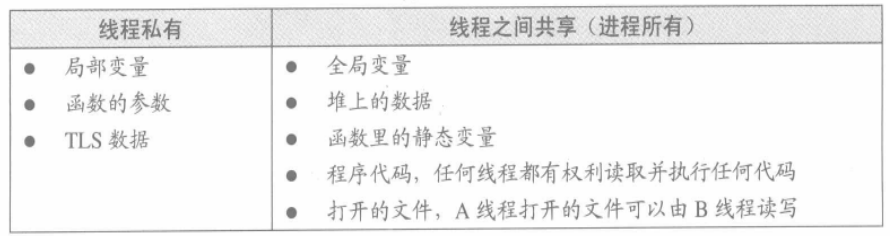

**线程调度与优先级**

  * 线程调度中的状态
   
    * 运行（Running）：此时线程正在执行。
    * 就绪（Ready）：此时线程可以立即运行，但CPU已经被占用。
    * 等待（Waiting）：此时线程正在等待某一事件（通常是I/O或同步）发生，无法执行。
   
  

  * 线程调度方案与算法
  
    * 优先级调度（Priority Schedule）
    * 轮转法（Round Robin）
  
  IO密集型线程总是比CPU密集型线程容易得到优先级的提升。

**Linux多线程**
  
  Linux将所有的执行实体（无论是线程和进程）都称为**任务**（Task），Linux下不同任务之间可以选择共享空间，所有共享了同一个内存空间的多个任务构成一个进程，这些任务也就成了这个进程里的线程。

  Linux创建新任务方式
  
  * fork 复制当前进程。
    
    fork产生和当前进程完全一样的新进程，新进程和当前进程共享一个**写时复制（Copy On Write，COW）的内存空间**，所有速度非常快。

  * exec 使用新的可执行映像覆盖当前可执行映像。

    执行新的可执行文件，一般配合fork使用。一起用于产生新任务。

  * clone 创建子进程并从指定位置开始执行。

    产生一个从指定的位置开始执行，并且（可选的）共享当前进程的内存空间和文件等。可用于创建一个新线程。

1.6.2 线程安全
-
**同步与锁**

* 二元信号（Binary Semaphore）
  
  只有两种状态，占用与非占用。只允许被唯一一个线程独占访问的资源。
  允许多个线程并发访问的资源，多元信号量简称**信号量（Semaphore）**。

* 互斥量（Mutex）
  
  与二元信号很类似，不同点是信号量在整个系统可以被任意线程获取并释放，而互斥量则要求哪个线程获取的就要哪个线程释放。

* 临界区（Critical Section）
  
  与互斥量和信号量的区别在于，后两者在系统的任何进程里都是可见的，而临界区的作用范围仅限于本进程。

* 读写锁（Read-Write Lock）
  
  两种获取方式，**共享的（Shared）** 或**独占的（Exclusive）**。

  | 读写锁状态 | 以共享方式获取 | 以独占方式获取 |
  | ---------- | -------------- | -------------- |
  | 自由       | 成功           | 成功           |
  | 共享       | 成功           | 等待           |
  | 独占       | 等待           | 等待           |

* 条件变量（Condition Variable）

**可重入（Reentrant）与线程安全**

一个函数要成为可重入的，必须具有如下几个特点

* 不使用任何（局部）静态或者全局的非const变量
* 不返回任何（局部）静态或全局的非const变量的指针
* 仅依赖于调用方提供的参数
* 不依赖任何单个资源的锁（mutex等）
* 不调用任何不可重入的函数

可重入是并发安全的强力保障，一个可重入的函数可以在多线程环境下放心使用。

**volatile关键字作用**

* 阻止编译器为了提高速度将一个变量缓存到寄存器内而不写回。
* 阻止编译器调整操作volatile变量的指令顺序，（但是阻止编译器调整指令顺序并不能解决根本问题，因为CPU也会动态调度换序）。

阻止CPU换序的方法是调用CPU提供的 **barrier** 指令，这条指令会阻止CPU将该指令之前的指令交换到它之后。例如：POWERPC 处理器

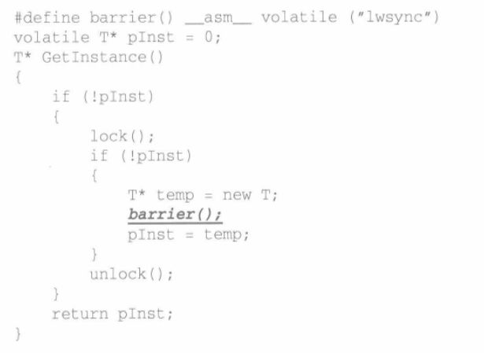

1.6.3 多线程内部情况
-
**三种线程模型**

* 一对一模型
  
  一个用户使用的线程就唯一对应一个内核使用的线程（但反过来不一定，一个内核线程在用户态不一定有对应的线程存在）。

  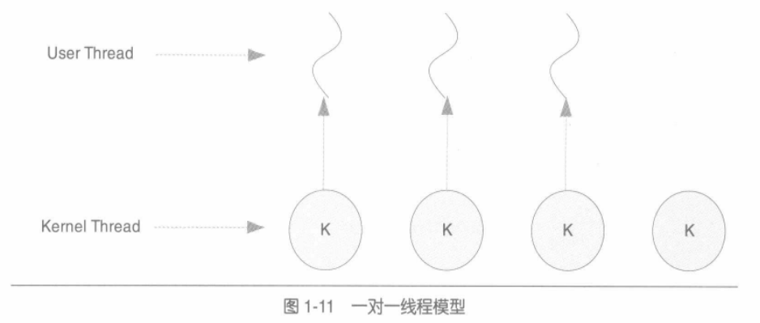
  
  这样线程之间的并发是真正的并发，线程之间执行不会相互影响，可以让多线程程序在多处理器的系统上有更好的表现。
  
  一般直接使用API或系统调用创建的线程均为一对一的线程。例如在Linux里使用 clone （带有CLONE_VM参数）。在Windows里，使用API CreateThread。

  缺点：
  
  * 线程数会受操作系统的限制（一般操作系统会限制内核线程数量）。
  * 许多操作系统内核线程调度时，上下文切换的开销较大，导致用户线程的执行效率下降。

* 多对一模型
  
  将多个用户线程映射到一个内核线程上，线程之间的切换由用户态的代码来进行，比一对一模型切换快速许多。

  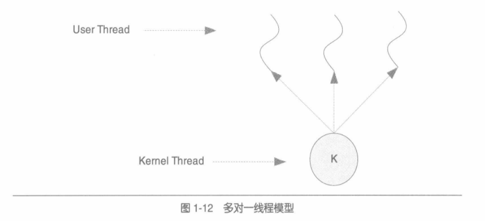

  多对一模型一大问题是，如果其中一个用户线程阻塞，那么所有的线程都将无法执行。多对一模型的好处是高效的上下文切换和几乎无限制的线程数量。

* 多对多模型
  
  多对多模型结合了多对一模型和一对一模型的特点，将多个用户线程映射到少数但不止一个内核线程上。

  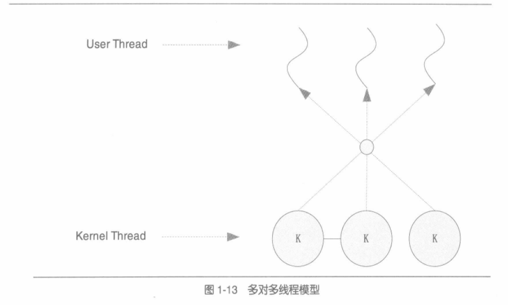

  在多对多模型中，一个用户线程阻塞并不会使得所有的用户线程阻塞，因为此时还有别的线程可以被调度执行。

# 2 静态链接

2.1 被隐藏的过程
-
**四个步骤：预处理（Prepressing）、编译（Compilation）、汇编（Assembly）、链接（Linking）。**

2.1.1 预编译
-
首先是源代码文件和相关头文件被编译成 **.i** 文件，相当于使用命令
```
$gcc -E hello.c -o hello.i
或者
$cpp hello.c > hello.i
```
预编译过程主要处理那些源代码中的以“#”开始的预编译指令。比如“include“、“#define”等，主要处理规则如下：

* 将所有的“#define”删除，并且展开所有的宏定义。
* 处理所有条件预编译指令，例如：“#if”、“#ifdef”、“#elif”、“#else”、“#endif”。
* 处理“#include”预编译指令，将被包含的文件插入到预编译指令的位置。注意，这个过程是递归进行的，也就是说被包含的文件可能还包含其他文件。
* 删除所有的注释“//”和“/* */”。
* 添加行号和文件名标识，比如 #2 “hello.c” 2，以便于编译时编译器产生调试用的行号信息及用于编译时产生编译错误或警告时能够显示行号。
* 保留所有的 #pragma 预编译指令，因为编译器需要使用它们。

2.1.2 编译
-
编译过程就是把预处理完的文件进行一系列词法分析、语法分析、语义分析及优化后生成相应的汇编代码文件。
```
$gcc -S hello.i -o hello.s
```
GCC已经将预编译和编译两个步骤合并成一个步骤，使用 **cc1** 来完成这两个步骤。或使用如下命令
```
$gcc -S hello.c -o hello.s
```

**所有实际上 gcc 这个命令会根据不同的参数要求去调用，预编译器程序 cc1、汇编器 as、链接器 ld。**

2.1.3 汇编
-
汇编器是将汇编代码转变成机器可以执行的指令，每一个汇编语句几乎都对应一条机器指令。
```
$as hello.s -o hello.o
或者
$gcc -c hello.s -o hello.o
或者
$gcc -c hello.c -o hello.o
```

2.1.4 链接
-
2.2 编译器做了什么
-
编译过程分6步
  * 扫描
  * 语法分析
  * 语义分析
  * 源代码优化
  * 代码生成
  * 目标代码优化

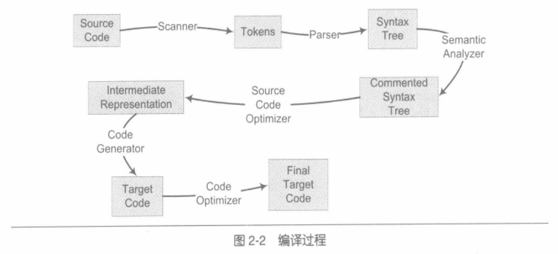

2.2.1 词法分析
-
词法分析产生的记号分类

* 关键字
* 标识符
* 字面量（包含数字、字符串等）
* 特殊符号（如加号、等号）

一般使用独立的词法扫描器完成（例如 lex）。另外对于一些有预处理的预言，预处理工作（例如宏替换和文件包含等）一般不归入编译器的范围，而交给一个独立的预处理器完成。

2.2.2 语法分析（Grammar Parser）
-
对词法扫描器产生的记号进行语法分析，从而产生**语法树（Syntax Tree）**。语法分析工具 yacc（Yet Another Compiler Compiler）。

2.2.3 语义分析
-
编译器所能分析的语义是 **静态语义（Static Semantic）**，所谓静态语义是指在编译期可以确定的语义，与之对应的 **动态语义（Dynamic Semantic）** 就是只有在运行期才能确定的语义。

2.2.4 中间语言生成
-
现代编译器有很多层次的优化，**源码级优化器（Source Code Optimizer）** 会在源码级别进行优化。由于直接在语法树上作优化比较困难，所以源码优化器会将整个语法树转换成**中间代码（Intermediate Code）**，常见的中间代码有：三地址码（Three-address Code）和 P-代码（P-Code）。

中间代码使得编译器可以分为前端和后端。编译器前端负责产生机器无关的中间代码，编译器后端将中间代码转换成目标机器代码。这样对于跨平台的编译器而言，针对不同的平台使用同一前端和针对不同机器平台的数个后端。

2.2.5 目标代码生成与优化
-
编译器后端主要包括 **代码生成器（Code Generator）**和**目标代码优化器（Target Code Optimizer）**。

2.3 链接器
-
重新计算各个目标的地址过程叫做 **重定位（Relocation）**。

**符号（Symbol）** 它用来表示一个地址，这个地址可以是一段子程序的起始地址，也可以是一个变量的起始地址。

2.4 静态链接
-
链接的主要内容就是把各个模块之间相互引用的部分都处理好，使得各个模块之间能正确地衔接。从原理上来讲，就是把一些指令对其他符号地址的引用加以修正。

链接过程包括

* 地址和空间分配（Address and Storage Allocation）
* 符号决议（Symbol Resolution）
* 重定位（Relocation）

最基本的静态链接过程是每个模块的源代码文件（如.c）文件经过编译器编译成目标文件（Object File，一般扩展名为 .o 或 .obj ），目标文件和库（Library）一起链接形成最终可执行文件。而最常见的库就是**运行时库（Runtime Library）**。

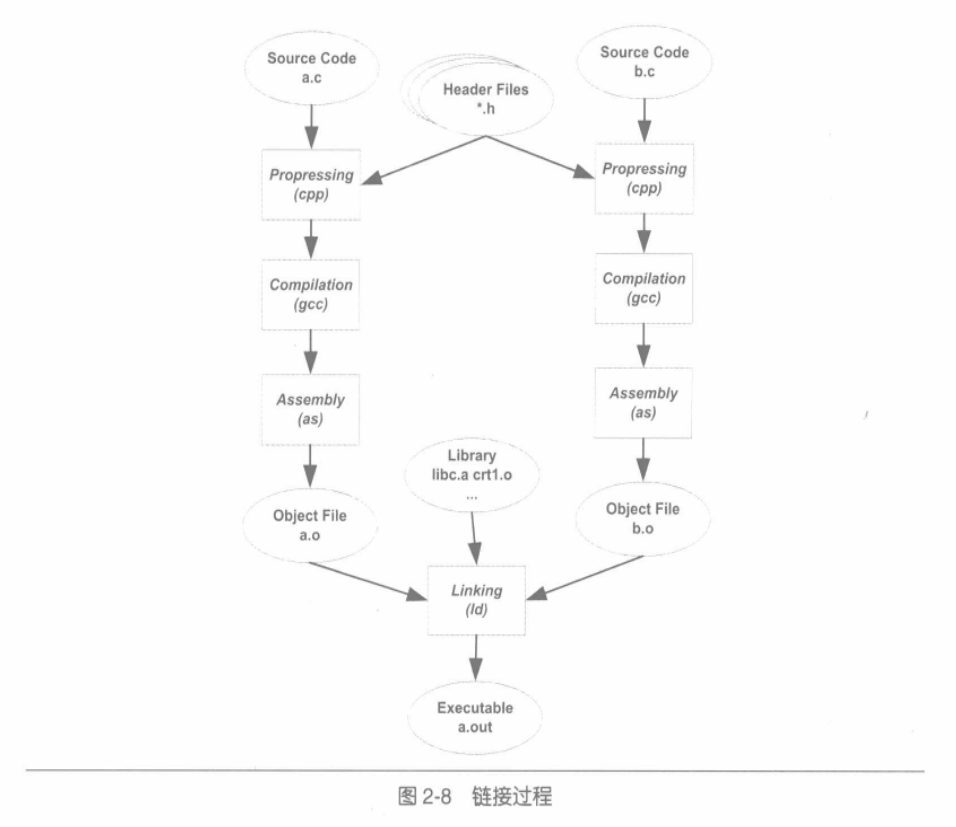


# 3 目标文件里有什么

3.1 目标文件的格式
-
Windows下的PE（Portable Executable）和 Linux的ELF（Executable Linkable Format），它们都是COFF（Common file format）格式的变种。

**动态链接库（DLL，Dynamic Linking Library）**（Windows的 .dll 和 Linux 的 .so）及**静态链接库（Static Linking Library）**（Windows的 .lib 和 Linux的 .a）文件都是可执行文件格式存储。

ELF格式文件归类

| ELF文件类型                        | 说明                                                                                                                                                                                                                               | 实例                                          |
| ---------------------------------- | ---------------------------------------------------------------------------------------------------------------------------------------------------------------------------------------------------------------------------------- | --------------------------------------------- |
| 可重定位文件（Relocation File）    | 这类文件包含了代码和数据，可以被用来链接成可执行文件或共享目标文件，静态链接库也可以归为这一类                                                                                                                                     | Linux的.o，Windows的.obj                      |
| 可执行文件（Executable File）      | 这类文件包含了可以直接执行的程序，它的代表就是ELF可执行文件，它们一般都没有扩展名                                                                                                                                                  | 比如/bin/bash文件，Winodws的.exe              |
| 共享目标文件（Shared Object File） | 这种文件包含了代码和数据，可以在一下两种情况下使用。一种时链接器可以使用这种文件跟其他的可重定位文件和共享目标文件链接，产生新的目标文件。第二种是动态链接器可以将几个这种共享目标文件与可执行文件结合，作为进程映像的一部分来运行 | Linux的.so，如/lib/glibc-2.5.so，Windows的DLL |
| 核心转储文件（Core Dump File）     | 当进程意外终止时，系统可以将该进程的地址空间的内容及终止时的一些其他信息转储到核心转储文件                                                                                                                                         | Linux下的core dump                            |

**在Linux下可以使用 file 命令查看相应文件格式。**

3.2 目标文件是什么样的
-
目标文件包含了编译后的机器指令、数据、链接时所需要的一些信息，比如符号表、调试信息、字符串等。一般目标文件将这些信息按不同的属性，以 **“节”（Section）** 的形式存储，有时候也叫 **“段”（Segment）** 。

编译后的机器指令经常放在 **代码段（Code Section）** 里，代码段常见的名字有 “.code” 或 “.text”。

全局变量和局部静态变量数据经常放在 **数据段（Data Section）** 里，数据段的一般名字都叫 “.data”。

未初始化的全局变量和局部静态变量一般放在一个叫 **“.bss”** 的段中，可执行文件必须记录所有未初始化的全局变量和局部静态变量的大小总和，记为.bss段。**所有 .bss 段只是为上述变量预留位置而已**，它并没有内容，所有它在文件中也不占据空间。

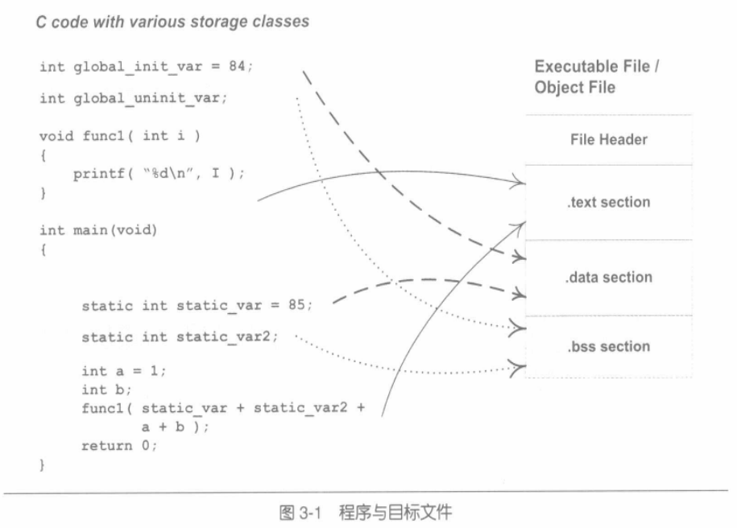

ELF文件的开头是一个“文件头”，它描述了整个文件的文件属性，包括文件是否可执行、是静态链接还是动态链接及入口地址（如果是可执行文件）、目标硬件、目标操作系统等信息，文件头还包括一个 **段表（Section Table）** ，段表其实是一个描述文件中各个段在文件中的偏移位置及段的属性的数组。

**总体来说，程序源代码被编译以后主要分为两种段：程序指令和程序数据。代码段属于程序指令，而数据段和 .bss 段属于程序数据。**

程序指令和数据分段的好处

* 数据和指令分别被映射到两个虚存区域，可以分别设置读写权限，数据区域为可读写，指令区域为可读，可以防止程序指令被修改。
* 现代CPU的缓存一般都被设计成数据缓存和指令缓存分离，所有指令和数据被分开存放对CPU的缓存命中率提高有好处。
* 在多进程中可以共享一份程序指令，节约内存。

3.3 挖掘 SimpleSection.o
-
SimpleSection.c
```
int printf(const char* format, ...);

int global_init_var = 84;
int global_uninit_var;

void func1(int i)
{
    printf("%d\n", i);
}

int main(void)
{
    static int static_var = 85;
    static int static_var2;

    int a = 1;
    int b;

    func1(static_var + static_var2 + a + b);

    return a;
}
```

objdump工具可以查看ELF文件信息，-h 参数表示查看基本信息，-x 参数可以查看更多的信息。

```
$ gcc -c SimpleSection.c

$ objdump -h SimpleSection.o
```

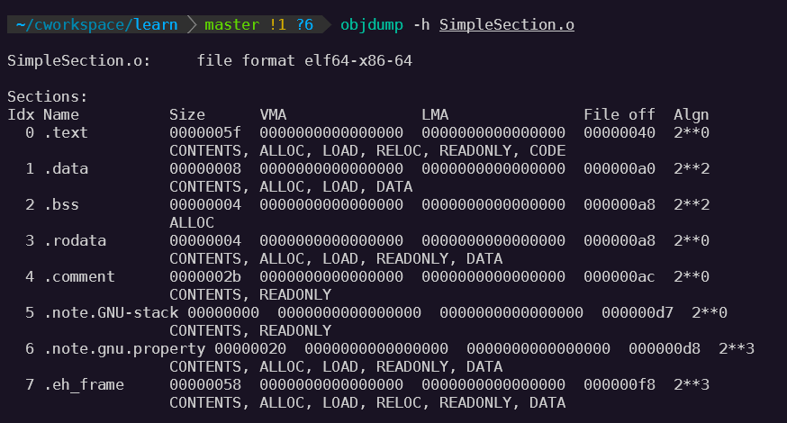

更多段信息：**只读数据段（.rodata）、注释信息段（.comment）、堆栈提示段（.note.GNU-stack）**。

size命令可以用来查看ELF文件的代码段、数据段和BSS段的长度（dec表示3个段长度总和的十进制，hex表示十六进制）。

```
$ size SimpleSection.o
```


3.3.1 代码段
-
objdump的 “-s” 参数可以将所有段的内容以十六进制的方式打印出来，“-d” 参数可以将所有包含的指令的段反汇编。

```
$ objdump -s -d SimpleSection.o
```

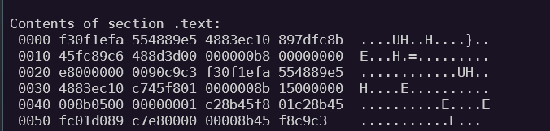


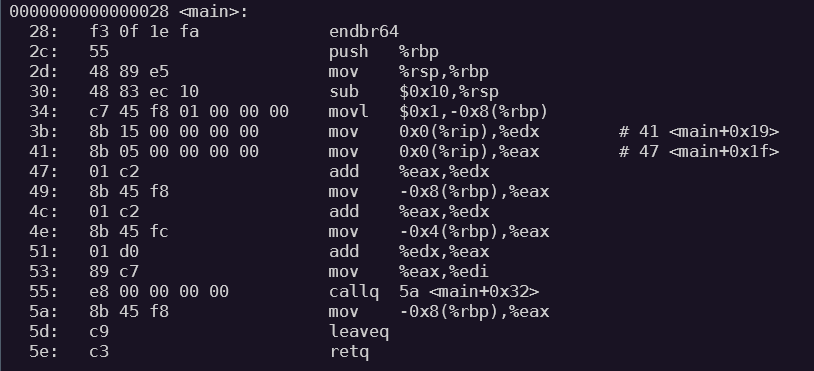

3.3.2 数据段和只读数据段
-

 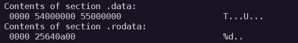

 .data 段中前4个字节，从低到高为 0x54、0x00、0x00、0x00。为十进制的 84，后四个字节为 0x55、0x00、0x00、0x00。为十进制的 85。

 3.3.3 BSS段
-
有些编译器会将**全部的未初始化变量**存放在 .bss 段，有些则不存放，只是预留一个**未定义的全局变量符号**，等到最终链接成可执行文件的时候再在 .bss 段分配空间。

3.3.4 其他段
-
**ELF其他常见段**

| 常用的段名   | 说明                                                                                         |
| ------------ | -------------------------------------------------------------------------------------------- |
| .rodata1     | Read only Data，这种段里存放的是只读数据，比如字符串常量、全局 const 变量。和 “.rodata” 一样 |
| .comment     | 存放的是编译器版本信息，比如字符串：“GCC:(GNU)4.2.0”                                         |
| .debug       | 调试信息                                                                                     |
| .dynamic     | 动态链接信息                                                                                 |
| .hash        | 符号哈希表                                                                                   |
| .line        | 调试时的行号表，即源代码行号与编译后指令的对应表                                             |
| .note        | 额外的编译器信息。比如程序的公司名、发布版本号等                                             |
| .strtab      | String Table（字符串表），用于存储ELF文件中用到的各种字符串                                  |
| .symtab      | Symbol Table（符号表）                                                                       |
| .shstrrab    | Section String Table（段名表）                                                               |
| .plt，.got   | 动态链接的跳转表和全局入口表                                                                 |
| .init，.fini | 程序初始化与终结代码段                                                                       |

>应用程序也可以使用一些非系统保留的名字作为段名。但自定义的段名不能使用 “.” 作为前缀。

**自定义段**

GCC 提供了一个扩展机制，可以指定变量所处的段，在全局变量或函数前加上 “\_\_attribute\_\_((section("name")))” 属性就可以将变量或函数放入到以 “name” 为段名的段中，如下：

```
__attribute__((section("FOO"))) int global = 42;

__attribute__((section("BAR"))) void foo()
{

}
```

3.4 ELF文件结构描述
-
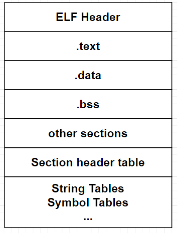

3.4.1 文件头
-
我们可以使用 readelf 命令来详细查看 ELF 文件

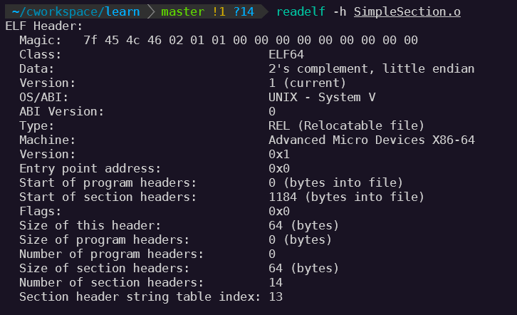

**ELF 文件中定义的数据**

* ELF 魔数
* 文件机器字节长度
* 数据存储方式
* 版本
* 运行平台
* ABI 版本
* ELF 重定位类型
* 硬件平台
* 硬件平台版本
* 入口地址
* 程序头入口
* 程序头长度
* 段表的位置
* 段表的长度
* 段的数量

**ELF中的变量体系：**

| 自定义类型   | 描述                   | 原始类型 | 长度（字节） |
| ------------ | ---------------------- | -------- | ------------ |
| Elf32_Addr   | 32位版本程序地址       | uint32_t | 4            |
| Elf32_Half   | 32位版本的无符号短整型 | uint16_t | 2            |
| Elf32_Off    | 32位版本的偏移地址     | uint32_t | 4            |
| Elf32_Sword  | 32位版本有符号整型     | int32_t  | 4            |
| Elf32_Word   | 32位版本的无符号整型   | uint32_t | 4            |
| Elf32_Xword  | 32位版本无符号长整型   | uint64_t | 8            |
| Elf32_Sxword | 32位版本有符号长整型   | int64_t  | 8            |
| Elf64_Addr   | 64位版本程序地址       | uint64_t | 8            |
| Elf64_Half   | 64位版本的无符号短整型 | uint16_t | 2            |
| Elf64_Off    | 64位版本的偏移地址     | uint64_t | 8            |
| Elf64_Sword  | 64位版本有符号整型     | int32_t  | 4            |
| Elf64_Word   | 64位版本的无符号整型   | uint32_t | 4            |
| Elf64_Xword  | 64位版本无符号长整型   | uint64_t | 8            |
| Elf64_Sxword | 64位版本有符号长整型   | int64_t  | 8            |

**ELF文件头结构**

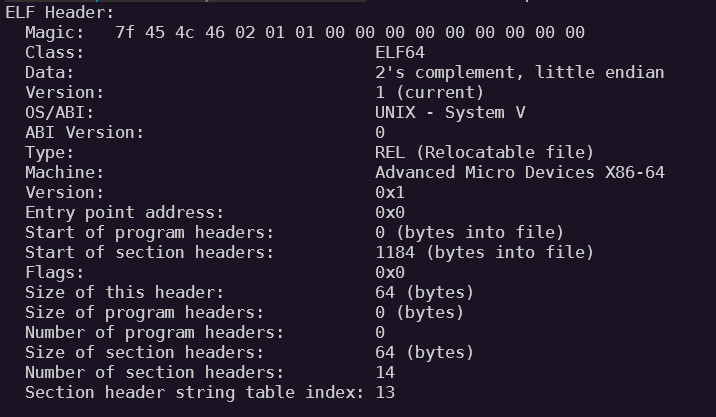

**ELF魔数（Magic）**

* 最开始的4个字节是所有ELF文件都必须相同的表示码，第1个字节是ASCII字符里的DEL控制符，后面3个字节是ELF这3个字母的ASCII码，这4个字节又被称为ELF文件的魔数。  
* 第5个字节标识ELF的文件类，0x00 无效文件，0x01 表示是 32 位的，0x02 表示是 64 位的。  
* 第6个字节是字节序，0x00 无效序，0x01 小端序，0x02 大端序。
* 第7个字节规定ELF文件的主版本号，一般是 1。
* 后面的9个字节ELF标准没有定义，一般填0，有些平台会使用这9个字节作为扩展标志。

**文件类型**（Type）

系统通过这个常量来判断ELF的真正文件类型，而不是通过文件的扩展名。

| 常量    | 值  | 含义                          |
| ------- | --- | ----------------------------- |
| ET_REL  | 1   | 可重定位文件，一般为 .o 文件  |
| ET_EXEC | 2   | 可执行文件                    |
| ET_DYN  | 3   | 共享目标文件，一般为 .so 文件 |
| ET_CORE | 4   | 核心转储文件                  |

**机器类型**（Machine）

ELF文件的平台属性，相关常量以 “EM_” 开头。详细信息请参考 “/usr/include/elf.h” 文件中的定义。

3.4.2 段表
-
段表描述了ELF文件中的各个段的信息，编译器、链接器和装载器都是依赖段表来定位和访问各个段的属性的。

显示段表结构：
```
$ readelf -S SimpleSection.o
```

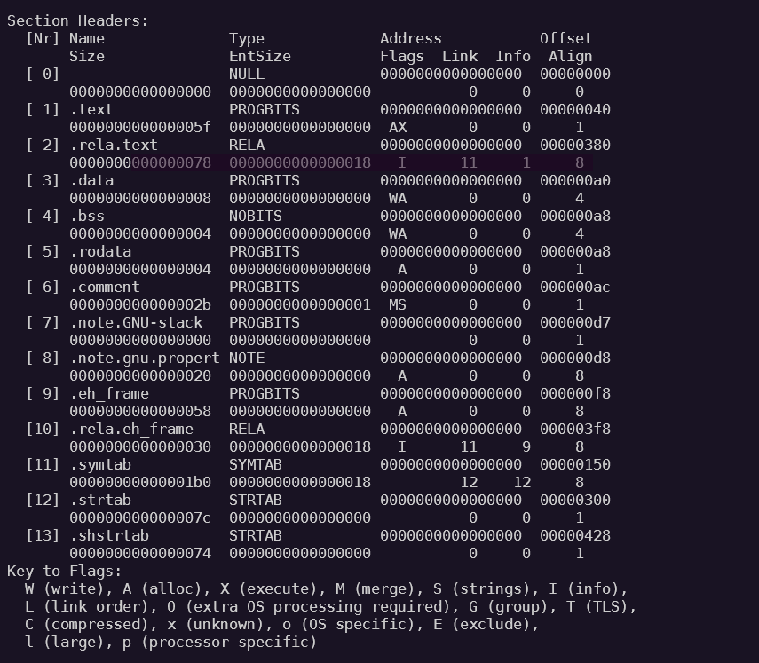

段表是以 “Elf32_Shdr”或 “Elf64_Shdr” 结构体为元素的数组。每个结构体对应一个段。该结构体又被称为**段扫描符（Section Descriptor）**。

**段的类型（sh_type）**

段的名字只是在链接和编译的过程中有意义，但它不能真正表示段的类型。主要决定段的属性的是段的类型（sh_type）和段的标志位（sh_flags）。段的类型相关常量以 SHT_ 开头。

|常量|值|含义|
|--|--|--|
|SHT_NULL|0|无效段|
|SHT_PROGBITS|1|程序段、代码段、数据段都是这种类型|
|SHT_SYMTAB|2|表示该段的内容为符号表|
|SHT_STRTAB|3|表示该段的内容为字符串表|
|SHT_RELA|4|重定位表，该段包含了重定位信息|
|SHT_HASH|5|符号表的哈希表|
|SHT_DYNAMIC|6|动态链接信息|
|SHT_NOTE|7|提示性信息|
|SHT_NOBITS|8|表示该段在文件中没内容|
|SHT_REL|9|该段包含了重定位信息|
|SHT_SHLIB|10|保留|
|SHT_DNYSYM|11|动态链接的符号表|

**段的标志位（sh_flag）**

表示段在进程虚拟地址空间中的属性，比如是否可写，是否可执行等。相关常量以 SHF_ 开头。

|常量|值|含义|
|--|--|--|
|SHF_WRITE|1|表示该段在进程空间中可写。|
|SHF_ALLOC|2|表示该段在进程空间中需要分配空间。比如代码段、数据段、.bss 段。|
|SHF_EXECINSTR|4|表示该段在进程空间中可以被执行，一般指代码段。|

**段的链接信息（sh_link、sh_info）**

如果段的类型是与链接相关的（不论是动态链接或静态链接），比如重定位表、符号表等，这两个成员是有意义的，对于其他类型的段，没有意义。

|sh_type|sh_link|sh_info|
|--|--|--|
|SHT_DYNAMIC|该段所使用的字符串表在段表中的下标|0|
|SHT_HASH|该段所使用的符号表在段表的下标|0|
|SHT_REL|该段所使用的相应符号表在段表中的下标|该重定位表所作用的段在段表中的下标|
|SHT_RELA|同上|同上|
|SHT_SYMTAB|操作系统相关的|操作系统相关的|
|SHT_DYNSYM|同上|同上|
|other|SHN_UNDEF|0|

3.4.3 重定位表
-
对于每个需要重定位的代码段或数据段，都会有一个相应的重定位表。例如 “.rel.text” 就是 “.text” 段的重定位表。一个重定位表同时也是ELF的一个段。

3.4.4 字符串表
-
ELF文件中会用到很多字符串，比如段名、变量名等。ELF会将这些字符串集中存放到一个表，通过字符串在表中的偏移来引用字符串。

|偏移|+0|+1|+2|+3|+4|+5|+6|+7|+8|+9|+10|+11|
|-|-|-|-|-|-|-|-|-|-|-|-|-|
||\0|h|e|l|l|o|w|o|r|l|d|\0|

>字符串表在ELF文件中以段的形式保存，常见段名为 “.strtab” 或 “.shstrtab” 。这两个字符串表分别为 **字符串表（String Table）** 和 **段表字符串表（Section Header String Table）** 。

3.5 链接的接口-符号
-
在链接中，我们将函数和变量统称为 **符号（Symbol）**，函数名或变量名就是 **符号名（Symbol Name）**。

每个目标文件都会有一个相应的 **符号表（Symbol Table）**，这个表记录目标文件中所用到的所有符号。每个定义的符号有一个对应的值，叫做 **符号值（Symbol Value）**，对于变量和函数来说，符号值就是它们的地址。

符号表中的符号分类：

* 定义在本目标文件的全局符号，可以被其他目标文件引用。
* 在本目标文件中引用的全局符号，却没有定义在本目标文件，这一般叫做 **外部符号（External Symbol）**。
* 段名，这种符号往往由编译器产生，它的值就是该段的起始地址。
* 局部符号，这类符号只在编译单元内部可见。这些局部符号对于链接过程没有作用，往往被链接器忽视。但是调试器可以使用这些符号来分析程序或崩溃时的核心转储文件。
* 行号信息，它是可选的。

查看ELF文件符号表工具

* readelf
* objdump
* nm

```
$ nm SimpleSection.o
```

3.5.1 ELF符号表结构
-
符号表段名一般叫 “.symtab”。它是一个 Elf32_Sym 或 Elf64_Sym 的结构数组。结构成员定义如下：

|变量名|含义|
|--|--|
|st_name|符号名，包含该符号名在字符串表中的下标|
|st_value|符号对应的值。可能是一个绝对值，也可能是一个地址，不同符号表示的含义不同|
|st_size|符号大小，如果该值为0，则表示该符号大小为0或未知|
|st_info|符号类型和绑定信息|
|st_other|该成员目前为0，没用|
|st_shndx|符号所在的段|

**符号类型和绑定信息**

低4位表示符号的类型，高28位表示符号绑定信息。

符号绑定信息：

|宏定义名|值|说明|
|--|--|--|
|STB_LOCAL|0|局部符号，对于目标文件的外部不可见|
|STB_GLOBAL|1|全局符号，外部可见|
|STB_WEAK|2|弱引用|

符号类型：

|宏定义名|值|说明|
|--|--|--|
|STT_NOTYPE|0|未知类型符号|
|STT_OBJECT|1|该符号是个数据对象，比如变量、数组等|
|STT_FUNC|2|该符号是个函数或其他可执行代码|
|STT_SECTION|3|该符号表示一个段，这种符号必须是 STB_LOCAL 的|
|STT_FILE|4|该符号表示文件名，一般都是该目标文件所对应的源文件名，它一定是 STB_LOCAL 类型的，并且它的 st_shndx 一定是 SHN_ABS|

**符号所在段（st_shndx）**

如果符号定义在本目标文件中，则表示符号所在的段在段表中的下标，如果不在，或者对于有些特殊符号，它表示的值如下：

|宏定义名|值|说明|
|--|--|--|
|SHN_ABS|0xfff1|表示该符号包含了一个绝对的值，比如表示文件名的符号|
|SHN_COMMON|0xfff2|表示该符号是一个 “COMMON块” 类型的符号，一般来说，未初始化的全局符号定义就是这种类型|
|SHN_UNDEF|0|表示该符号未定义，该符号在本目标文件被引用到，但是定义在其他目标文件中|

**符号值（st_value）**

每个符号都有一个对应的值，如果是函数或变量的定义，则是它们的地址。

* 在目标文件中，如果是符号的定义并且该符号不是 “COMMON块” 类型，则该值表示该符号在段中的偏移。
* 在目标文件中，如果符号是 “COMMON快” 类型的，则该值表示该符号的对齐属性。
* 在可执行文件中，该值表示符号的虚拟地址。

3.5.2 特殊符号
-
特殊符号定义在 ld 链接器的链接脚本中。

* __executable_start，该符号为程序的起始地址，注意不是入口地址，是程序的最开始的地址。
* __etext 或  _etext 或 etext，该符号为代码段的结束地址，即代码段最末尾的地址。
* _edata 或 edata，该符号为数据段结束地址，即数据段最末尾的地址。
* _end 或 end，该符号为程序结束地址。

以上地址都为程序被装载时的虚拟地址。可以在程序中直接使用这些符号。

3.5.3 符号修饰与函数签名
-
由于不同的编译器采用不同的名称修饰方法，必然导致编译产生的目标文件无法正常相互链接。

3.5.4 extern “C”
-
为了使 C++ 兼容 C 代码。C++编译器会将在 extern “C”  的大括号内部的代码当作 C 语言代码处理。

3.5.5 弱符号与强符号
-
对于 C/C++ 语言来说，编译器默认函数和已初始化的全局变量为 **强符号**，未初始化的全局变量为 **弱符号**。也可以通过 GCC 的 “\_\_attribute\_\_((weak))” 来定义任何一个强符号为弱符号。
>强符号和弱符号都是针对定义来说的，不是针对符号的引用。

 链接器会按如下规则处理与选择多次定义的全局符号

 * 不允许强符号被多次定义，如果存在，则链接器报重复定义错误。
 * 如果一个符号在某个目标文件中时强符号，在其他文件中时弱符号，那么选择强符号。
 * 如果一个符号在所有目标文件中多是弱符号，那么选择其中占用空间最大的一个。

**弱引用和强引用**

* 强引用（Strong Reference）
  >符号引用在目标文件最终链接成可执行文件时，如果没有找到该符号的定义，链接器就会报符号未定义错误。
* 弱引用（Weak Reference）
  >如果符号未定义，链接器对于该引用不报错。

在 GCC 中，我们可以通过使用 “\_\_attribute\_\_((weakref))” 来声明对一个外部函数的引用为弱引用。

3.6 调试信息
-

# 4 静态链接

4.1 空间与地址分配
-
链接器空间分配策略为 **相似段合并** ，比如将所有输入文件的 .text 段合并到输出文件的 .text 段。使用这种方法的链接器一般都采用一种叫 **两步链接（Two-pass Linking）** 的方法。

* 第一步，空间与地址分配
* 第二步，符号解析与重定位

>链接后的程序中所使用的地址已经是程序在进程中的虚拟地址，即 VAM（Virtual Memory Address）。

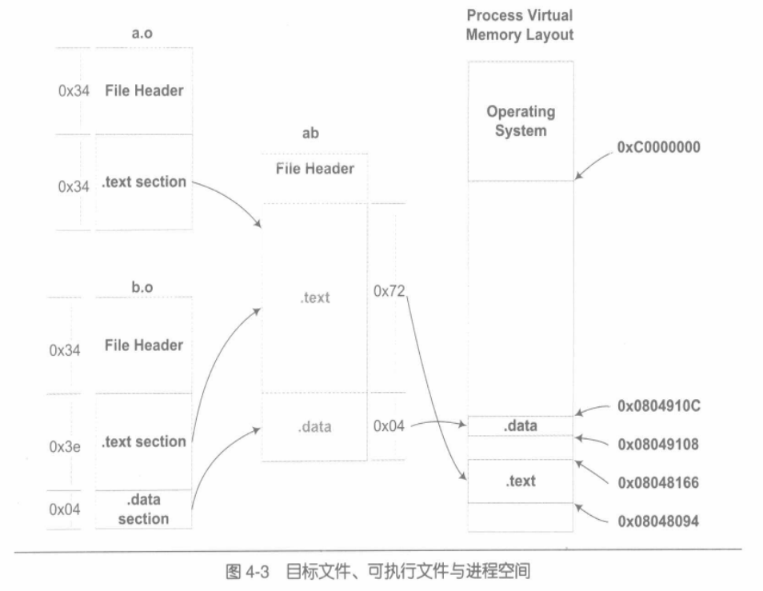

4.1.3 符号地址的确定
-
通过符号在其被定义的目标文件中的对应段中的偏移和链接后段的虚拟地址，来确定符号的虚拟地址（链接后段虚拟地址 + 偏移）。

4.2 符号解析与重定位
-
4.2.1 重定位
-
4.2.2 重定位表
-
ELF文件通过 **重定位表（Relocation Table）** 保存这些与重定位相关的信息。可以通过下述命令查看：

```
$ objdump -r a.o
```
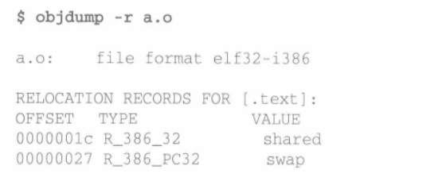

>每个要被重定位的地方叫一个 **重定位入口（Relocation Entry）**。重定位入口的 **偏移（Offset）** 表示该入口在要被重定位的段中的位置。

4.2.3 符号解析
-
使用如下命令查看目标文件的符号表：
```
$ readelf -s a.o
```
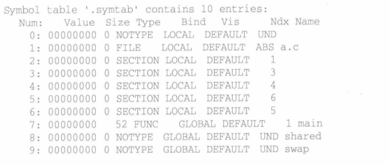

4.2.4 指令修正方式
-
* 绝对寻址修正（S + A）


* 相对寻址修正（S + A - P）

>A = 保存在被修正位置的值，P = 被修正的位置（相对于段开始的偏移量或者虚拟地址，S = 符号的实际位置，即由 r_info 的高 24 位指定的符号实际地址。

区别：绝对寻址修正后的地址为该符号的实际地址，相对寻址修正后的地址为符号距离被修正位置的地址差。

4.3 COMMON块
-
GCC 的“-fno-common”也允许我们把所有未初始化的全局变量不以 COMMON 块的形式处理，或者使用 “\_\_attribute\_\_((nocommon))”。
>这时此符号相当于一个强符号

4.5 静态库链接
-
5 Windows PE/COFF
-
略过...

6 可执行文件的装载与进程
-
6.1 进程虚拟地址空间
-
6.2 装载方式
-
系统将程序最常用的部分驻留内存，而将一些不太常用的数据存放在磁盘里，这就是动态装入的基本原理。

典型的动态装载方法

* 覆盖装入（Overlay）
* 页映射（Paging）
  
  页映射是将内存和所有磁盘中的数据和指令按照“页（Page）”为单位划分成若干个页，以后所有的装载和操作的单位就是页。

6.3 从操作系统角度看可执行文件的装载
-
6.3.1 进程的建立
-
创建一个进程，然后装载相应的可执行文件并执行：

* 创建一个独立的虚拟地址空间。
* 读取可执行文件头，并且建立虚拟空间与可执行文件的映射关系。
* 将CPU的指令寄存器设置成可执行文件的入口地址，启动运行。

6.3.2 页错误
-
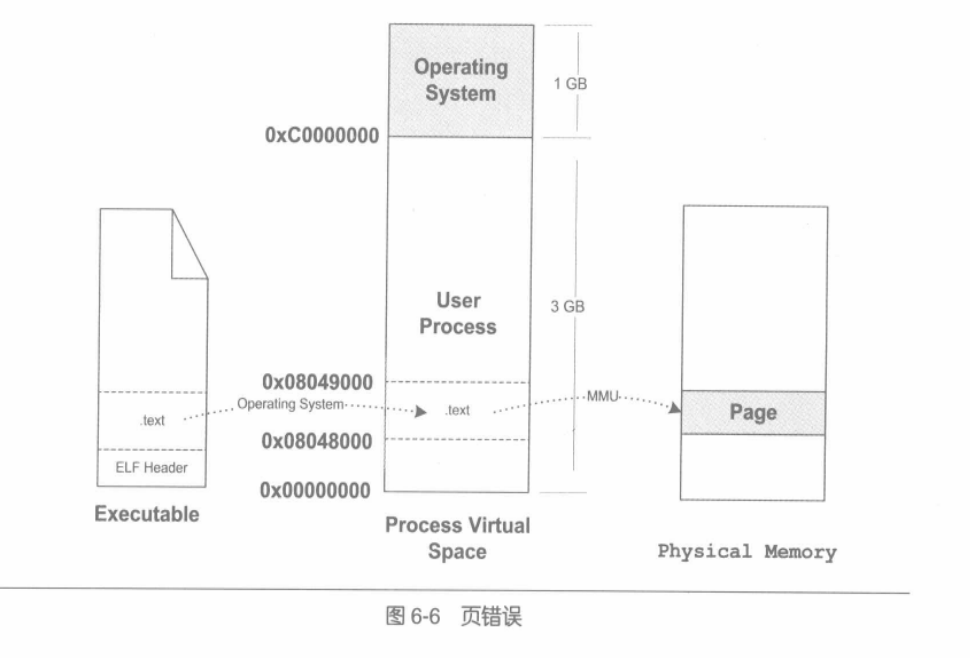

6.4 进程虚存空间分布
-
6.4.1 ELF文件链接视图和执行视图
-
**操作系统只关心ELF文件中段的权限**

ELF文件中段的权限：

* 以代码段为代表的权限为可读可执行的段。
* 以数据段和BSS段为代表的权限为可读可写的段。
* 以只读数据段为代表的权限为只读的段。
  
>对于相同权限的段，把它们合并到一起当作一个段进行映射。可以节约内存。

ELF可执行文件引入了一个概念叫“Segment”，一个“Segment”包含一个或多个属性类似的“Section”。

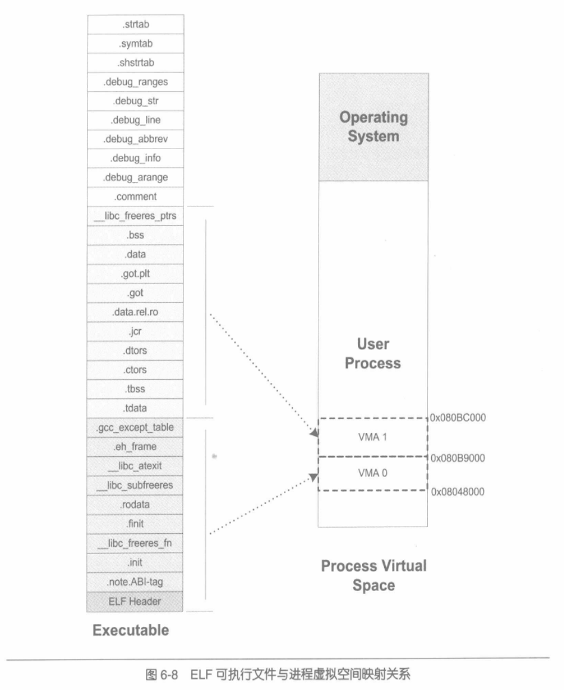

从“Section”的角度来看ELF文件就是 **链接视图（Linking View）**，从“Segment”的角度来看就是 **执行视图（Execution View）**。
>ELF可执行文件中有一个专门的数据结构叫做 **程序头表（Program Header Table）用来保存“Segment”的信息。

6.4.2 堆和栈
-
堆和栈在进程的虚拟空间中也是以 VMA 的形式存在，但是它们并没有被映射到文件中，这种 VMA 叫做 **匿名虚拟内存区域（Anonymous Virtual Memory Area）。

一个进程基本分为如下几种 VMA 区域：

* 代码 VMA，权限只读、可执行，有映像文件。
* 数据 VMA，权限可读写、可执行，有映像文件。
* 堆 VMA，权限可读写、可执行，无映像文件，匿名，可向上扩展。
* 栈 VMA，权限可读写、不可执行，无映像文件，匿名，可向下扩展。

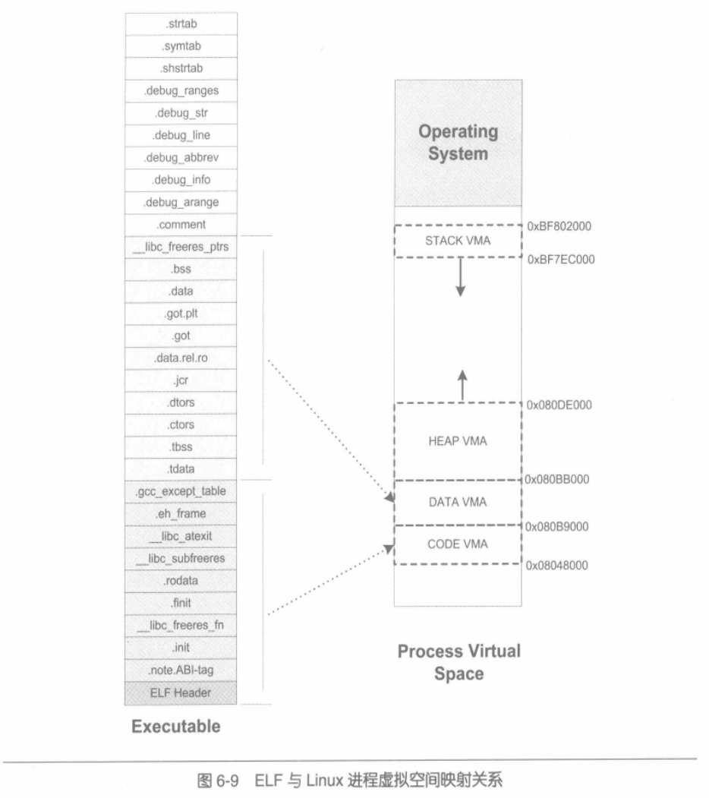

6.4.3 堆的最大申请数量
-
6.4.4 段地址对齐
-
在ELF文件中，对于任何一个可装载的“Segment”，它的 p_vaddr 除以对齐属性的余数等于 p_offset 除以对齐属性的余数。

6.4.5 进程栈初始化
-
操作系统在进程启动前将系统环境变量和进程的运行参数的信息提前保存到进程的虚拟空间栈中。

进程启动以后，程序的库部分会将堆栈里的初始化信息中的参数信息传递給 main() 函数。

6.5 Linux内核装载ELF过程简介
-
Linux系统执行某个ELF程序时，首先在用户层面，bash进程会调用 fork( ) 系统调用创建一个新的进程，然后新的进程调用 execve( ) 系统调用执行指定的ELF文件。

Linux内核中的装载工作：

* execve( ) 系统调用相应的入口是 sys_execve( )。
* sys_execve( ) 进行一些参数的检查复制后，调用 do_execve( )。
* do_execve( ) 会首先查找被执行的文件，如果找到文件，则读取文件的前 128 字节。确定文件的类型。
* 然后调用 search_binary_handle( ) 去搜索与文件类型对应的可执行文件装载处理过程。（比如ELF可执行文件的装载处理过程叫做 load_elf_binary( ) ）。

  load_elf_binary 的主要步骤：

  * 1、检查ELF可执行文件格式的有效性。
  * 2、寻找动态链接的 “.interp” 段，设置动态链接器路径。
  * 3、根据ELF可执行文件的程序头表的描述，对ELF文件进行映射。
  * 4、初始化ELF进程环境，比如进程启动时的 EDX 寄存器的地址应该是 DT_FINI 的地址。
  * 5、将系统调用的返回地址修改成ELF可执行文件的入口点。
  >这个入口点取决于程序的链接方式，对于静态链接的ELF可执行文件，这个程序入口就是ELF文件的文件头中 e_entry 所指的地址，对于动态链接的ELF可执行文件，程序入口点是动态链接器。

当 load_elf_binary( ) 执行完毕，返回至 do_execve( ) 再返回至 sys_execve( ) 时，上面的第 5 步中已经把系统调用的返回地址改成了被装载的ELF程序的入口地址了。所以当 sys_execve( ) 系统调用从内核态返回到用户态时，EIP 寄存器直接跳转到了ELF程序的入口地址，ELF可执行文件装载完成。

6.6 Windows PE 的装载
-
略...

# 7 动态链接
7.1 为什么要动态链接
-
* 静态链接极大的浪费磁盘空间个内存空间。
* 静态链接对程序的更新、部署、发布带来很多麻烦。
  
  >对于静态链接来说，每次依赖库的改动都会导致程序需要重新链接，而对动态链接来说，有些情况下不需要重新链接。

**动态链接会把链接这个过程推迟到运行时再进行。**

7.2 简单的动态链接例子
-
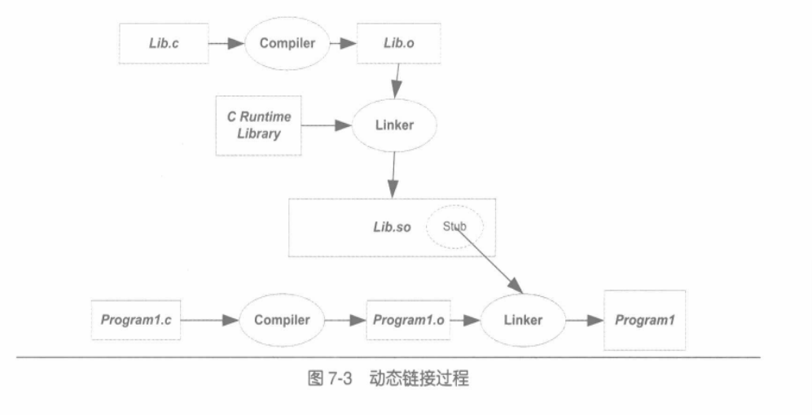

在动态链接中，可执行文件和程序依赖的动态库都可以看成程序的一个模块。

对于程序引用动态库中符号，链接器只会将这个符号的引用标记为一个动态链接的符号，不会对它进行地址重定位，而是把这个过程留到装载时进行。

**共享对象的最终装载地址在编译时是不确定的，而是在装载时，装载器根据当前地址空间的空虚情况，动态分配。**

7.3 地址无关代码
-
7.3.1 固定装载地址的困扰
-
共享对象的地址会产生冲突。

7.3.2 装载时重定位
-
系统在装载程序的时候需要对程序的指令和数据中对绝对地址的引用进行重定位，这种重定位被称为 **装载时重定位（Load Time Relocation）**。
>装载时重定位不能解决共享对象的装载问题，因为指令被重定位后对于每个进程来将是不同的。没办法做到一份指令被多个进程共享。但对共享对象中的可修改数据来说，这个方法是有用的，每个进程有自己的数据副本。

7.3.3 地址无关代码
-
基本思想是把指令中那些需要被修改的部分分离出来，跟数据部分放在一起，这样指令部分就可以保持不变，而数据部分可以在每个进程拥有一个副本。

共享对象模块中的地址引用：

* 模块内部的函数调用、跳转等。
  
  >采用相对地址调用（函数之间的相对地址是固定的）。

* 模块内部的数据访问，比如模块中定义的全局变量、静态变量。
  
  >采用当前指令地址（PC）+ 偏移量 的方式，来访问相应变量。

* 模块外部的数据访问，比如其他模块中定义的全局变量。
  
  >ELF会在数据段里里面建立一个 **指向这些变量的指针数组**，也被称为 **全局偏移表（Global Offset Table，GOT）。**

* 模块外部的函数调用、跳转等。
  
  >同外部数据访问的方式，GOT 中相应的保存项是目标函数的地址。

区分一个动态库是否为 PIC
```
$ readelf -d foo.so | grep TEXTREL
```
  如果上述命令有任何的输出，则不是 PIC 的（TEXTREL 表示代码段重定位表地址）。

**-fPIE 地址无关可执行文件**

7.3.4 共享模块的全局变量问题
-
ELF共享库在编译时，默认都把定义在模块内部夫人全局变量当作定义在其他模块的全局变量，通过 GOT 来实现变量的访问。

7.3.5 数据段地址无关性
-
动态链接器会在装载时重定位数据段中的绝对地址引用。

7.4 延迟绑定
-
动态链接比静态链接慢的主要原因：

* 动态链接下对全局和静态的数据访问都要进行复杂的 GOT 定位，然后间接寻址。对于模块间的调用也要先定位 GOT，然后进行间接跳转。
* 动态链接的链接工作在运行时完成，即程序开始执行时动态链接器都要进行一次链接工作。

动态链接的优化：

* 延迟绑定，当函数第一次被用到时才进行绑定（符号查找、重定位等）。
  
  >ELF 使用 PLT（Procedure Linkage Table）的方法来实现。

ELF将 GOT 拆分成了 “.got” 和 “.got.plt” 两个表。“.got” 保存全局变量引用的地址，“.got.plt” 保存函数引用的地址。

“.got.plt” 前三项的特殊含义：

* 第一项保存的是 “.dynamic” 段的地址，这个段描述了本模块动态链接相关的信息。
* 第二项保存的是本模块的 ID。
* 第三项保存的是 _dl_runtime_resolve( ) 的地址。

>其中第二项和第三项由动态链接器在装载共享模块的时候负责将它们初始化。其余项分别对应每个外部函数的引用。

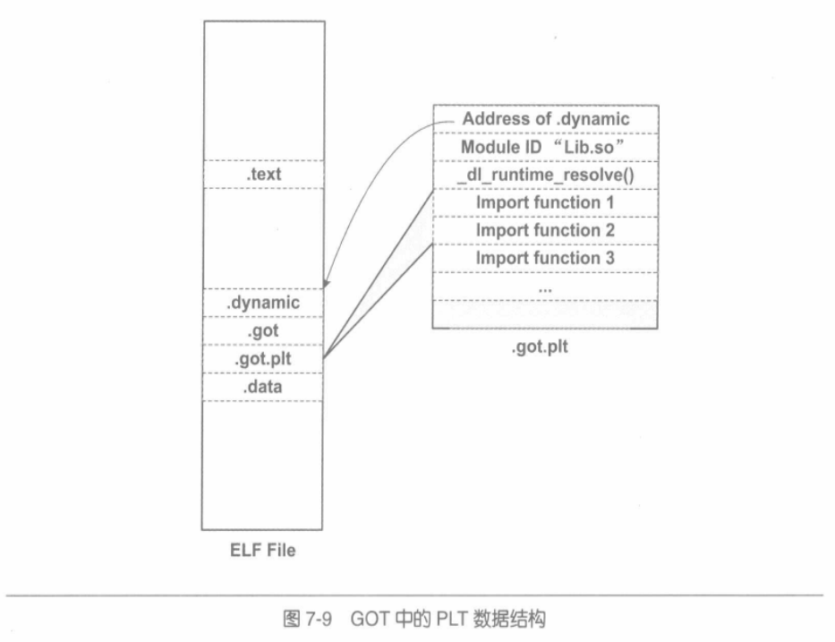

7.5 动态链接相关结构
-
动态链接在映射完执行文件后，操作系统会先启动一个 **动态链接器（Dynamic Linker）**。

操作系统加载完动态链接器后，会将控制权交给动态链接器的入口地址。在操作完之后，再将控制权交给可执行文件入口地址。

7.5.1 “.interp” 段
-
ELF所需动态链接器的路径存放在此段中，此路径是一个软连接。

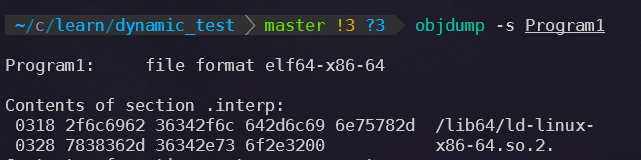

7.5.2 “.dynamic” 段
-
这个段保存动态链接器所需要的基本信息，比如依赖于哪些共享对象、动态链接符号表的位置、动态链接重定位表的位置、共享对象初始化代码的地址等。

“.dynamic” 段结构

```
typedef struct {
  Elf32_Sword d_tag;
  union {
    Elf32_World d_val;
    Elf32_Addr d_ptr;
  } d_un;
} Elf32_Dyn;
```

|d_tag 类型|d_un 的含义|
|--|--|
|DT_SYMTAB|动态链接符号表的地址，d_ptr 表示 “.dynsym” 的地址|
|DT_STRTAB|动态链接字符串表地址，d_ptr 表示 “.dynstr” 的地址|
|DT_STRSZ|动态链接字符串表大小，d_val 表示大小|
|DT_HASH|动态链接哈希表地址，d_ptr 表示 “.hash” 的地址|
|DT_SONAME|本共享对象的 “SO-NAME”|
|DT_RPATH|动态链接共享对象搜索路径|
|DT_INIT|初始化代码地址|
|DT_FINIT|结束代码地址|
|DT_NEED|依赖的共享对象文件，d_ptr 表示所依赖的共享对象文件名|
|DT_REL，DT_RELA|动态链接重定位表地址|
|DT_RELENT，DT_RELAENT|动态重读位表入口数量|

**查看 “.dynamic” 段的内容**
```
$ readelf -d Lib.so
```

**查看一个程序主模块或一个共享库依赖于哪些共享库**
```
$ ldd Program1
```

7.5.3 动态符号表（Dynamic Symbol Table）
-
**“.dynsym” 段**

保存动态链接模块间的符号导入导出关系的段叫 “.dynsym”。与静态链接不同的是 该段只保存了与动态链接相关的符号，对于模块内部的符号则不保存。
>很多时候动态链接的模块同时拥有 “.dynsym” 和 “.symtab”。“.symtab” 保存所有符号。

**“.dynstr” 段，动态符号字符串表**

7.5.4 动态链接重定位表
-
因为共享对象的数据段包含了绝对地址的引用以及部分代码段中也包含绝对地址引用（会被分离出来），所有共享对象在被装载时也需要重定位。

共享对象中的重定位表：

* “.rel.dyn” 段
  
  实际是对数据引用的修正，它所修正的位置位于 “.got” 以及数据段。

* “.rel.plt” 段
  
  对函数引用的修正，它所修正的位置位于 “.got.plt”。

查看动态链接的文件的重定位表
```
$ readelf -r Lib.so
```
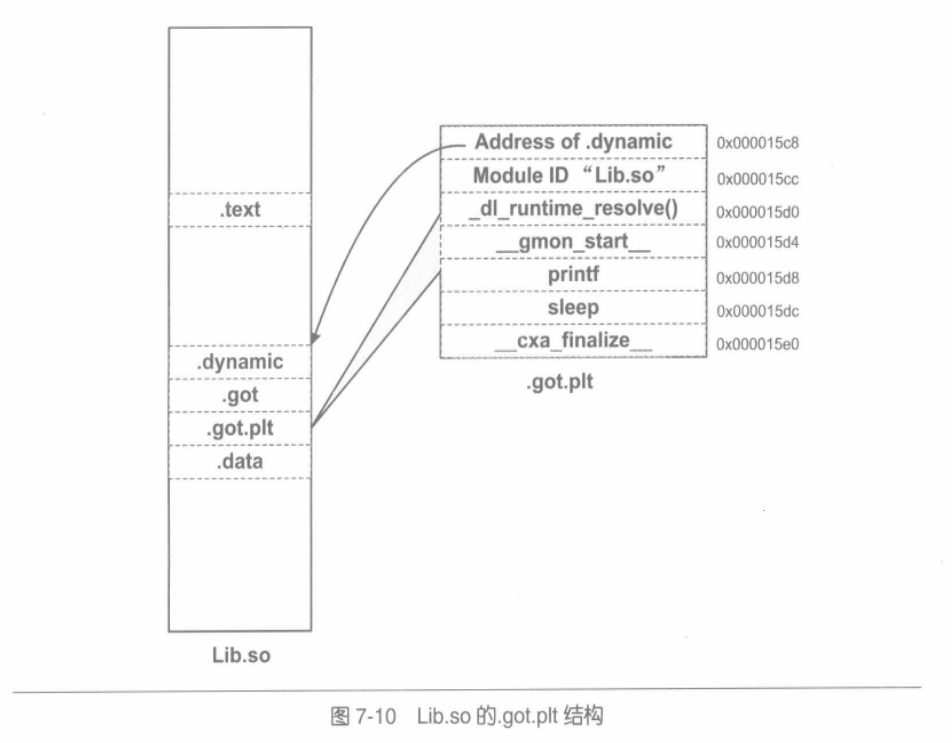

7.5.5 动态链接时进程堆栈初始化信息
-
堆栈中除了保存操作系统传递给动态链接器的一些信息外，还保存了动态链接器所需要的一些 **辅助信息数组（Auxiliary Vector）**。
```
typedef struct
{
  uint32_t a_type;
  union
  {
    uint32_t a_val;
  } a_un; //历史遗留问题，没用
} Elf32_auxv_t;
```

|a_type 定义|a_type 值|a_val 的含义|
|---|---|---|
|AT_NULL|0|表示辅助信息数组结束|
|AT_EXEFD|2|表示可执行文件的文件句柄|
|AT_PHDR|3|可执行文件中 **程序头表（Program Header）** 在进程中的地址|
|AT_PHENT|4|可执行文件头中程序头表中每一个入口（Entry）的大小|
|AT_PHNUM|5|可执行文件头中程序头表中入口（Entry）的数量|
|AT_BASE|7|表示动态链接器本身的装载地址|
|AT_ENTRY|9|可执行文件入口地址，即启动地址|

7.6 动态链接的步骤和实现
-
7.6.1 动态链接器自举
-
动态链接器本身不可以依赖于其他任何共享文件。且不能使用全局和静态变量。

7.6.2 装载共享对象
-
**符号优先级**

如果链接的两个共享文件中定义了相同的全局符号，符号会出现覆盖现象，这种现象又被称为 **共享对象全局符号介入（Global Symbol Interpose）**。

Linux下的动态链接器处理规则：当一个符号需要被加入全局符号表时，如果相同的符号名已经存在，则后加入的符号被忽略。

7.6.3 重定位和初始化
-
如果共享对象有 “.init” 段，那么动态链接器会执行 “.init” 段中的代码来进行共享对象特有的初始化。比如共享对象中 C++ 的全局/静态对象的构造函数。

如果共享对象中有 “.finit” 段，当进程退出时会执行此段中的代码，可以用来实现类似 C++ 全局对象析构之类的操作。

>可执行文件中的 “.init” 段和 “.finit” 段不由动态链接器执行，而由程序初始化部分代码负责执行。

7.7 显式运行时链接（Explicit Run-time Linking）
-
有时候也叫 **运行时加载**。也就是让程序自己在运行时控制加载指定的模块，并且可以在不需要该模块时将其卸载。

在进行时进行装载的共享对象，一般称为 **动态装载库（Dynamic Loading Library）**。

动态库装载 API，定义在 \<dlfcn.h\> 中。

* 打开动态库（dlopen）
* 查找符号（dlsym）
* 错误处理（dlerror）
* 关闭动态库（dlclose）

例子：
```
#include <stdio.h>
#include <dlfcn.h>

int main(int argc, char* argv[])
{
    void* handle;
    double (*func)(double);
    char* error;

    handle = dlopen(argv[1], RTLD_NOW);
    if(handle == NULL)
    {
        printf("Open library %s error: %s\n", argv[1], dlerror());
        return -1;
    }

    func = dlsym(handle, "sin");
    if((error = dlerror()) != NULL)
    {
        printf("Symbol sin not found: %s\n", error);
        goto exit_runso;
    }

    printf("%f\n", func(3.1415926 / 2));

exit_runso:
    dlclose(handle);
}
```

# 8 Linux共享库的组织
8.1 共享库版本
-
8.1.1 共享库兼容性
-
共享库更新分类

* 兼容更新，所有更新只是在原有的基础上添加一些内容，所有原有的接口都保持不变。
* 不兼容更新，共享库更新改变了原有的接口，使用该共享库原有接口的程序可能不能运行或运行不正常。

导致 C 语言的共享库 ABI（Application Binary Interface）改变行为：

* 导出函数的行为发生改变。
* 导出函数删除。
* 导出数据的结构发生变化。
* 导出函数的接口发生变化。

8.1.2 共享库版本命名
-
Linux 共享库命名规则：libname.so.x.y.z

* 前缀为 lib，中间时库的名字，后缀是 .so
* x 表示主版本号。
  
  主版本号表示库的重大升级，不同主版本号的库之间是不兼容的。

* y 表示此版本号。

  此版本号表示库的增量升级，即增加一些新的接口符号，且保存原来的符号不变。

* z 表示发布版本号。
  
  发布版本号表示库的一些错误的修正、性能的改进等，并不添加任何新的接口，也不对接口进行更改。

8.1.3 SO-NAME
-
Linux采用 SO-NAME 的命名机制来记录共享库的依赖关系。

SO-NAME 就是共享库的文件名去掉此版本号和发布版本号。
>例如 libfoo.so.2.6.1 的 SO-NAME 为 libfoo.so.2

**Linux 提供 “ldconfig” 工具，用来更新或者创建共享库的软连接，使它们指向最新版的共享库。**

8.2 符号版本
-
SO-NAME 并没有解决次版本问题，即程序依赖于较高次版本的共享库，但运行在较低次版本号的共享库时，就可能产生缺少某些符号的错误（新版的次版本的共享库可能添加了一些旧版没有的符号）。

8.2.1 基于符号的版本机制
-
基本思路是让每个导出和导入的符号都有一个相关联的版本号，类似于名称修饰的方法。

8.3 共享库系统路径
-
大多数 Linux 系统都遵循 FHS（File Hierarchy Standard）标准。

系统主要存放共享库的位置：

* /lib，主要存放系统最关键和基础的共享库
* /usr/lib，主要保存的是一些非系统运行时所需要的关键性的共享库，主要是开发时用到的库。
* /usr/local/lib，主要放一些第三方库。

8.4 共享库查找过程
-
如果 “.dynamic” 段里的 DT_NEED 类型的项里面保存的绝对路径，那么动态链接器就按照这个路径去查找，如果是相对路径，那么会在 /lib、/usr/lib 和由 /etc/ld.so.conf 配置文件指定的目录中查找共享库。

8.5 环境变量
-
**LD_LIBRARY_PATH**

默认为空，需要主动设置。
```
$ LD_LIBRARY_PATH=/home/usr /bin/ls
```
>相当于链接时 GCC 的 -L 参数，对于共享库的开发和测试十分方便，但不建议在线上环境中使用。

**LD_PRELOAD**

可以指定预先装载的一些共享库或目标文件。
>系统配置文件 /etc/ld.so.preload 有一样的作用。

**LD_DEBUG**

可以打开动态链接器的调试功能。

* LD_DEBUG=files，打印整个装载过程，显示程序依赖于哪个共享库，按什么步骤加载和初始化，共享库装载时的地址等。
* LD_DEBUG=bindings，显示动态链接的符号绑定过程。
* LD_DEBUG=libs，显示共享库的查找过程。
* LD_DEBUG=versions，显示符号的版本依赖关系。
* LD_DEBUG=reloc，显示重定位过程。
* LD_DEBUG=symbols，显示符号查找过程。
* LD_DEBUG=statistics，显示动态链接过程中的各种统计信息。
* LD_DEBUG=all，显示以上所有信息。
* LD_DEBUG=help，显示上面的各种可选值的帮助信息。

8.6 共享库的创建和安装
-
8.6.1 共享库的创建
-
使用如下命令生成共享库
```
$ gcc -shared -W1,-soname,my_soname -o library_name source_files library_files
```

注意事项：

* 不要去掉输出共享库中的符号和调试信息，也不要使用 GCC 的 “-formit-frame-pointer” 选项，会影响调试共享库。
* 默认情况下，链接器在产生可执行文件时，只会将那些链接时被其他共享模块引用到的符号放到动态符号表，这样可以减少动态符号表的大小。但是在程序中使用 dlopen( ) 动态加载某个共享模块，而该共享模块须反向引用主模块的符号时，有可能主模块的某些符号因为在链接时没有被其他共享模块引用而没有被放到动态符号表里面，导致反向引用失败。解决方法：ld 链接器提供 “-export-dynamic” 参数，可以将所有全局符号导出到动态符号表。或者使用 GCC 的 “-W1,-export-dynamic” 参数。

8.6.2 清除符号信息
-
使用 “strip” 工具清除掉共享库或可执行文件的所有符号信息和调试信息。或者使用 ld 的 “-s” 和 “-S” 参数，使得链接器生成输出文件时不产生符号信息。在 GCC 中通过 “-W1,-s” 和 “-W1,-S”。
> -s 清除所有符号信息，-S 清除调试符号信息。

8.6.3 共享库的安装
-
使用 ldconfig 建立 SO-NAME。
```
$ ldconfig -n shared_library_directory
```

GCC 提供两个参数 “-L” 和 “-l”，分别用于指定共享库搜索目录和共享库的路径。

8.6.4 共享库构造和析构函数
-
GCC 提供方法来实现构造和析构

* 构造，在函数声明时加上 “\_\_attribute\_\_((constructor))”。这种函数会在共享库加载时被执行。
  ```
  void __attribute__((constructor)) init_function(void);
  ```
* 析构，在函数声明时加上 “\_\_attribute\_\_((destructor))”。这种函数在 main( ) 函数执行完毕之后执行（或者是程序调用 eixt( ) 时执行。如果共享库是运行时加载的，在 dlclose( ) 返回之前执行。
  ```
  void __attribute__((destructor)) fini_function(void);
  ```

**注意，如果使用了上述的构造和析构函数，那么必须使用系统默认的标准运行库和启动文件，即不可以使用 GCC 的 “-nostartfiles” 或 “-nostdlib” 这两个参数**。

多个构造函数按照一定的顺序执行，GCC 提供优先级参数，对于构造函数，优先级数字越小的函数越先运行。对于析构函数来说相反。
```
void __attribute__((constructor(5))) init_function1(void);
void __attribute__((constructor(10))) init_function2(void);
```

8.6.5 共享库脚本
-

# 9 Winodws下的动态链接
略...

# 10 内存

10.1 程序的内存布局
-
程序使用的内存空间有如下“默认”的区域。

* 栈，用于维护函数调用的上下文。通常在用户空间额最高地址处分配。
* 堆，用来容纳应用程序动态分配的内存区域，通常存在于栈的下方（低地址方向）。
* 可执行文件映像。
* 保留区，对内存中受到保护而禁止访问的内存区域的总称。

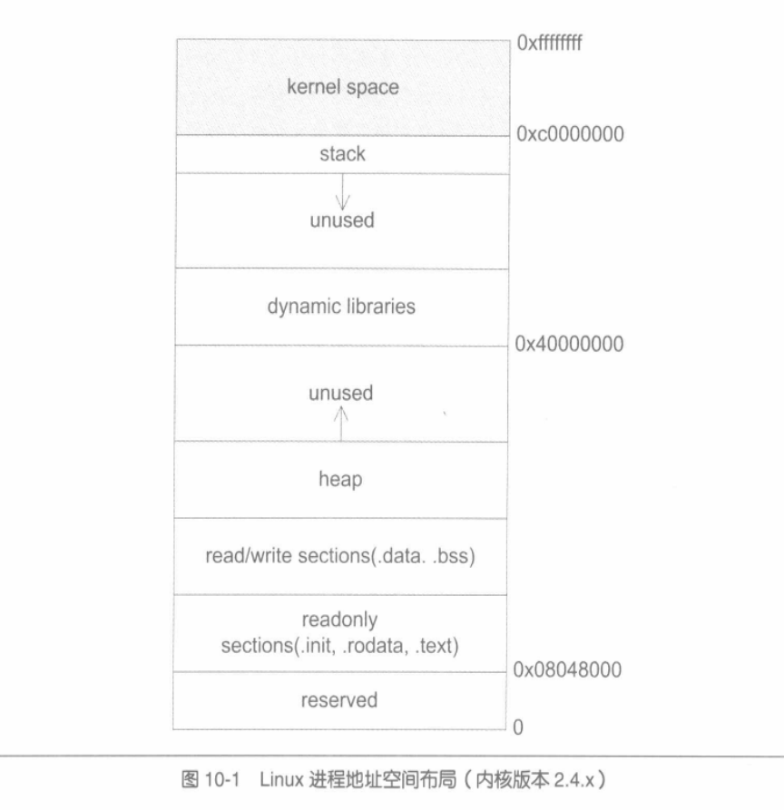

10.2 栈与调用惯例
-
10.2.1 什么是栈
-
一种先进后出的数据容器，在操作系统中栈总是 **向下增长** 的。

栈顶由称为 esp 的寄存器进行定位，压栈使栈顶的地址减少，出栈使栈顶的地址增大。


栈保存了一个函数调用所需要的维护信息，通常称为 **堆栈帧（Stack Frame）**，堆栈帧一般包括如下几个方面内容：

* 函数的返回地址和参数。
* 临时变量：包括函数的非静态局部变量以及编译器自动生成的其他临时变量。
* 保存的上下文：包括在函数调用前后需要保持不变的寄存器。

ebp 寄存器指向了函数活动记录的一个固定位置，ebp 寄存器又被称为 **帧指针（Frame Pointer）。

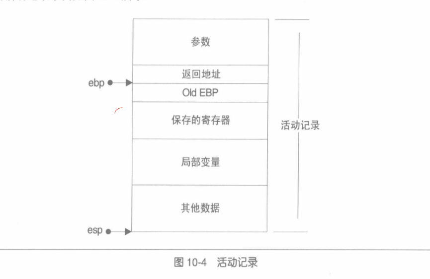

10.2.2 调用惯例
-
惯例会规定如下几个方面：

* 函数参数的传递顺序和方式
* 栈的维护方式
* 名字修饰的策略

C 语言主要的调用惯例：

|调用惯例|出栈方|参数传递|名字修饰|
|--|--|--|--|
|cdecl|函数调用方|从右至左的顺序压参数入栈|下划线+函数名|
|stdcall|函数本身|从右至做的顺序压参数入栈|下划线+函数名+@+参数的字节数|
|fastcall|函数本身|头两个DWORD（4字节）类型或占更少字节的参数被放入寄存器，其他剩下的参数按从右到左的顺序压入栈|@+函数名+@+参数字节数|
|pascal|函数本身|从左至右的顺序压参数入栈|较为复杂，参见pascal文档|

>C++ 还有一种特殊的调用惯例，称为 thiscall，专用于类成员函数的调用，在 VC 中 this 指针存放于 ecx 寄存器，参数从右到左压栈，而对于 GCC 来说，thiscall 和 cdecl 完全一样，只是将 this 看作是函数的第一个参数。

10.2.3 函数返回值传递
-

10.3 堆与内存管理
-
10.3.1 什么是堆
-
堆是一块巨大的内存空间，占据整个虚拟空间的绝大部分。在这片空间里，程序可以请求一块连续内存，并自由地使用。

10.3.2 Linux进程堆管理
-
两种堆空间分配方式：

* brk( ) 系统调用
  
  实际上就是设置进程数据段的结束地址，即它可以扩大或者缩小数据段。如果将数据段的结束地址向高地址移动，那么扩大的那部分空间就可以用来做堆空间。
* mmap( )
  
  向操作系统申请一段虚拟空间，这段虚拟空间可以映射到某个文件（最初的作用），当它不将地址空间映射到某个文件时，又称这块空间为 **匿名空间（Anonymous space）**，匿名空间可以用作堆空间。

10.3.3 Winodws进程堆管理
-
略...

10.3.4 堆分配算法
-
1. 空闲链表
   
   实际上就是把堆中各个空闲的块按照链表的方式连接起来，当用户请求一块空间时，遍历链表，直到找到合适大小的块并且将它拆分，当用户释放空间时将它合并到空闲链表中。

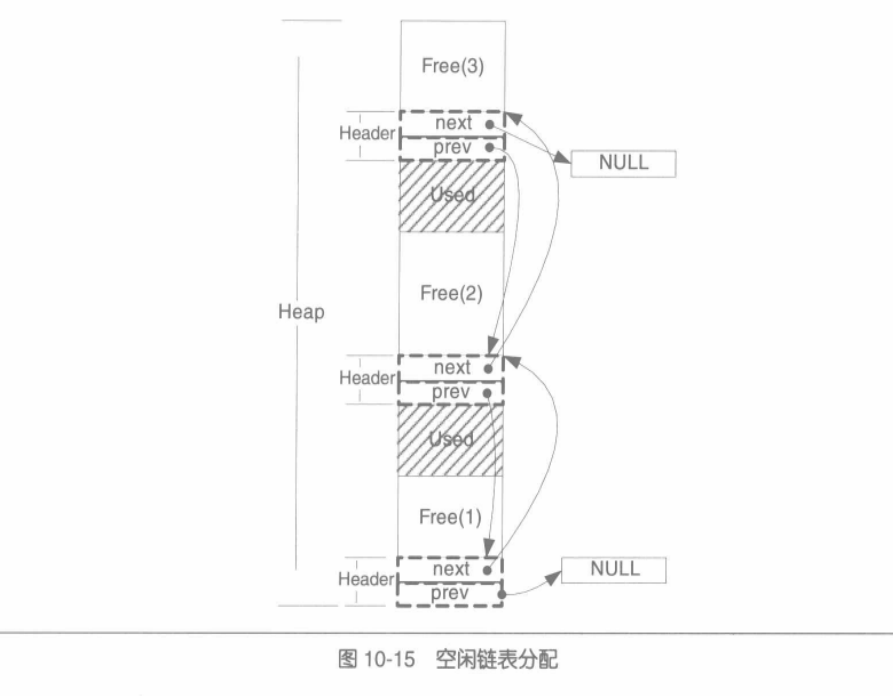

2. 位图
   
   将整个堆划分为大量的 **块（block）**，每个块的大小相同。当用户请求内存时，总是分配整数个块的空间给用户，第一块称为已分配区域的 **头（Head）**，其余的称为已分配区域的 **主体（Body）**。

   优点：

   * 速度块，由于整个堆的空闲信息存储在一个数组中，因此访问该数组时的 cache 容易命中。
   * 稳定性好，只需简单备份位图就可以避免用户越界读写破坏数据。
   * 块不需要额外信息，易于管理。
  
   缺点：

   * 分配内存时容易产生内存碎片。
   * 如果堆很多，或者设定的一个块很小（可以减少内存碎片），那么位图将会很大，可能失去 cache 命中率高的优势，而且也会浪费一定的空间（针对这种情况可以使用多级的位图）。
  
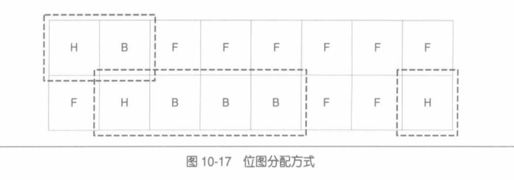
  
3. 对象池

   如果每一次分配的空间大小都一样，那么就可以按照这个每次请求分配的大小作为一个单位，把整个堆空间划分为大量的小块，每次请求时只需找到一个小块就可以了。
   >对象池的管理可以采用空闲链表，也可以采用位图。


# 11 运行库
11.1 入口函数和程序初始化
-
11.1.1 程序从 mian 开始吗？
-

在执行 main 函数之前，会执行一些代码来准备 main 函数执行所需要的环境，运行这些代码的函数称为 **入口函数或入口点（Entry Point）。

典型的程序运行步骤：

* 操作系统在创建进程后，把控制权交到了程序的入口，这个入口往往时运行库中的某个入口函数。
* 入口函数对运行库和程序运行环境进行初始化，包括堆、I/O、线程、全局变量构造等。
* 入口函数在完成初始化之后，调用 main 函数，正式开始执行程序主体部分。
* main 函数执行完毕以后，返回到入口函数，入口函数进行清理工作，包括全局变量析构、堆销毁、关闭 I/O 等，然后进行系统调用结束进程。

11.1.2 入口函数如何实现
-
**GLIBC 入口函数**

位于 glibc/sysdeps中，由汇编语言实现（start.S）。

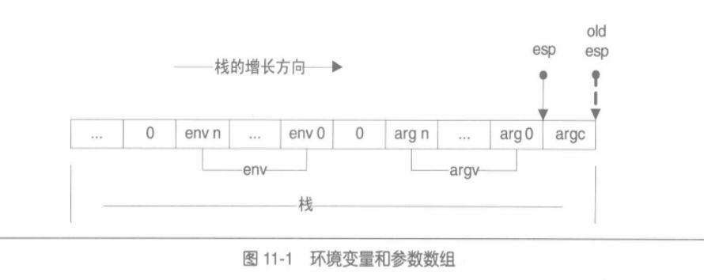

**MSVC CRT 入口函数**

默认入口函数为 mainCRTStartup( )。

总体流程：

* 初始化和 OS 版本相关的全局变量。
* 初始化堆。
* 初始化 I/O。
* 获取命令行参数和环境。
* 初始化 C 库的一些数据。
* 调用 main 并记录返回值。
* 检查错误并将 main 的返回值返回。

11.1.3 运行库与 I/O
-
